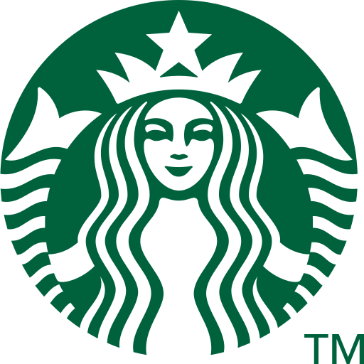

# Starbucks Menu Explorer



Aplicação de coleta e exploração visual das informações nutricionais do cardápio da Starbucks. O projeto consolida os dados em um CSV e disponibiliza uma interface interativa para comparar itens por categoria e nutriente.

**[Acessar aplicação publicada](https://starbucksnutritionanalysis.streamlit.app/)**

> Projeto independente, sem afiliação com a Starbucks. Os dados têm origem no conteúdo disponibilizado pelo site oficial e podem mudar a qualquer momento.

## Visão geral

O repositório contém duas etapas complementares:

1. **Coleta:** percorre o menu, consulta os dados nutricionais de cada produto e gera `starbucks_menu.csv`.
2. **Exploração:** carrega o arquivo gerado em um painel Streamlit, permitindo selecionar subcategoria e indicador nutricional.

O conjunto de dados presente no repositório contém **213 produtos**, distribuídos entre as categorias `drinks` e `food` e **13 subcategorias**.

## Tecnologias

| Tecnologia | Uso |
| --- | --- |
| Python | Coleta, transformação e orquestração dos dados |
| Requests | Requisições HTTP aos endpoints JSON usados pelo site |
| Pandas | Estruturação, exportação e tratamento do dataset |
| Streamlit | Interface web interativa |
| Plotly Express | Gráficos interativos |

## Fonte e interação com os dados

A coleta usa os endpoints JSON consumidos pelo próprio menu online:

- `https://www.starbucks.com/bff/ordering/menu` fornece a árvore de categorias e produtos;
- `https://www.starbucks.com/bff/ordering/{productNumber}/{formCode}` fornece a ficha nutricional de cada item.

O script percorre a estrutura do menu de forma recursiva. Para cada produto, combina nome, caminho de categoria, URL pública e informações nutricionais em um único registro. A ficha inclui porção, calorias, gorduras, colesterol, sódio, carboidratos, fibras, açúcares, proteína e cafeína.

O tamanho de bebida registrado é a primeira opção devolvida pela API — correspondente à menor opção considerada na coleta. Como produtos podem ser personalizados e a composição do cardápio varia, os valores devem ser interpretados como referência, não como garantia nutricional.

## Decisões de dados

- A hierarquia do menu é preservada nas colunas `Category`, `Subcategory` e `Subsubcategory`, facilitando análises em diferentes níveis.
- As categorias `merchandise` e `at home coffee` foram excluídas por não fazerem parte da análise nutricional do cardápio preparado.
- A subcategoria `bottled beverages` também foi removida do recorte.
- Itens sem ficha nutricional continuam no CSV quando disponíveis no menu, mas ficam fora dos gráficos para evitar comparações incompletas.
- A cafeína é buscada pelo nome do atributo, em vez de depender de uma posição fixa na resposta; quando ausente, recebe valor `0`.
- As unidades textuais (`g`, `mg` e `fl oz`) são mantidas no CSV bruto e convertidas para números somente na camada de visualização.

## Painel e gráficos

O painel permite escolher uma subcategoria e uma métrica: calorias, gorduras, colesterol, sódio, carboidratos, fibras, açúcares, proteína ou cafeína.

- **Gráfico de barras:** compara todos os itens da subcategoria selecionada. A cor segue um gradiente de branco para verde Starbucks (`#036635`), reforçando visualmente a intensidade do indicador sem dispensar a escala quantitativa.
- **Leitura dos extremos:** o painel exibe os itens de maior e menor valor da métrica escolhida, incluindo empates.
- **Legibilidade:** nomes de produtos ficam inclinados em 45° e o gráfico tem dimensão fixa de 800 × 600 px para comportar listas extensas.
- **Casos sem ocorrência:** quando o maior valor da métrica é zero, a interface informa a ausência do nutriente e troca para um gráfico de linha, evitando sugerir uma diferença que não existe.
- **Interação:** os gráficos Plotly oferecem tooltip, zoom e exportação de imagem diretamente no navegador.

## Estrutura do projeto

```text
.
├── main.py                 # Coleta do menu e das informações nutricionais
├── app.py                  # Dashboard Streamlit
├── starbucks_menu.csv      # Dataset gerado pela coleta
├── starbucks.png           # Identidade visual exibida na interface
├── requirements.txt        # Dependências da aplicação
└── LICENSE.md              # Licença MIT
```

## Como executar

Pré-requisito: Python 3.10 ou superior.

```bash
git clone https://github.com/<seu-usuario>/Starbucks_Web_Scraping.git
cd Starbucks_Web_Scraping
python -m venv .venv
```

Ative o ambiente virtual e instale as dependências:

```bash
# Windows (PowerShell)
.venv\Scripts\Activate.ps1

# macOS/Linux
source .venv/bin/activate

pip install -r requirements.txt
```

Para atualizar o dataset a partir do menu online:

```bash
python main.py
```

Para iniciar o painel:

```bash
streamlit run app.py
```

O Streamlit abrirá a aplicação no navegador, normalmente em `http://localhost:8501`.

## Limitações e observações

- O projeto depende de endpoints internos utilizados pelo site, que podem ser alterados ou descontinuados sem aviso.
- A disponibilidade de produtos e as informações nutricionais variam por localidade e ao longo do tempo.
- Os valores refletem receitas padrão; personalizações podem alterar a composição final.
- A recomendação geral de 2.000 kcal/dia é apenas uma referência e não substitui orientação profissional.

## Licença

Distribuído sob a [Licença MIT](LICENSE.md).
